# Awesome Login pages

A Project which includes curated list of different login page web pages.

| Name           |  Desktop Screenshot                                                                                                                           |Mobile Screenshot                                                             | Contributed by                                     |
| -------------- | --------------------------------------------------------------------------------------------------------------------------------------------- |------------------------------------------------------------------------------|-------------------------------------------------- |
| login-form-01  |     |    |  [@hiteshkumawat](https://github.com/hiteshkumawat) [@nshanbhag20001412](https://github.com/nshanbhag20001412) |
| login-form-02  |    |    | [@hiteshkumawat](https://github.com/hiteshkumawat) [@nshanbhag20001412](https://github.com/nshanbhag20001412)|
| login-form-03  |    |    | [@abhir9](https://github.com/abhir9)               [@nshanbhag20001412](https://github.com/nshanbhag20001412)|
| login-form-04  |    |    | [@hiteshkumawat](https://github.com/hiteshkumawat) [@nshanbhag20001412](https://github.com/nshanbhag20001412)|
| login-form-05  |    |    | [@abhir9](https://github.com/abhir9)               [@nshanbhag20001412](https://github.com/nshanbhag20001412)|
| login-form-06  |    |    | [@abhir9](https://github.com/abhir9)               [@nshanbhag20001412](https://github.com/nshanbhag20001412)|
| login-form-07  |    |    | [@hiteshkumawat](https://github.com/hiteshkumawat) [@nshanbhag20001412](https://github.com/nshanbhag20001412)|
| login-form-08  |    |    | [@abhir9](https://github.com/abhir9)               |
| login-form-09  |    |    | [@abhir9](https://github.com/abhir9)               |
| login-form-10  |    |    | [@hiteshkumawat](https://github.com/hiteshkumawat) |
| login-form-11  |    |    | [@abhir9](https://github.com/abhir9)               |
| login-form-12  |    |    | [@abhir9](https://github.com/abhir9)               |
| login-form-13  |    |    | [@hiteshkumawat](https://github.com/hiteshkumawat) |
| login-form-14  |    |  | [@tirtharajsinha](https://github.com/tirtharajsinha)  |
| login-form-15  |    |  | [@MaramHarsha](https://github.com/MaramHarsha) [@harshkulkarni17](https://github.com/harshkulkarni17)
| login-form-16  | 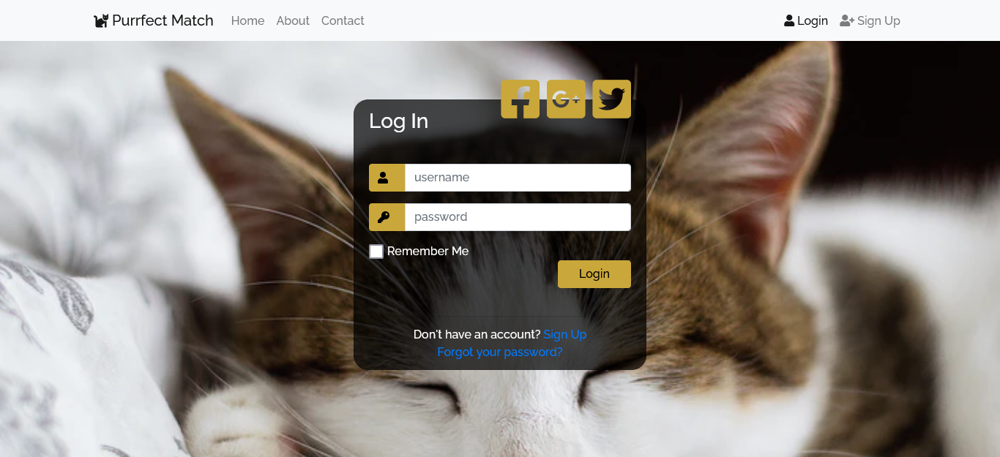  |  | [@haaaziq](https://github.com/haaaziq)  |
| login-form-18  | 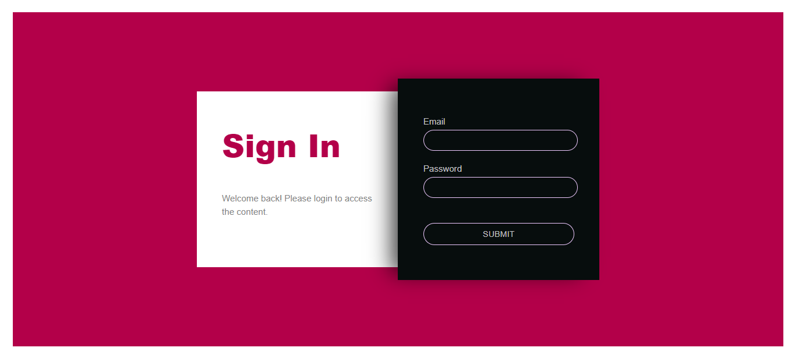   |  || [@highflyer910](https://github.com/highflyer910)
| login-form-19  |    | 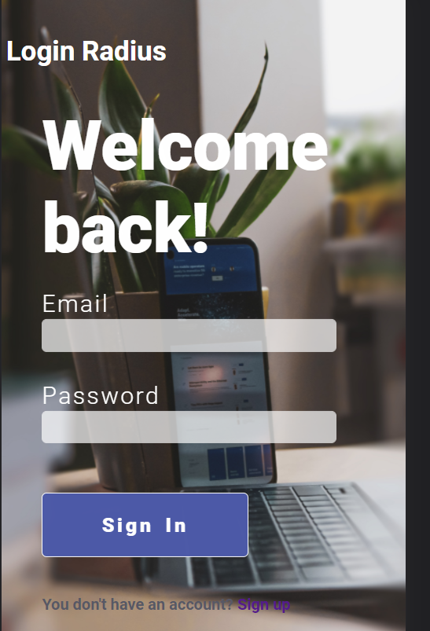 | [@siddhantgore](https://github.com/siddhantgore) 
| login-form-20  |    |  || [@kinkusuma](https://github.com/kinkusuma)
| login-form-21  |   | | [@harshkulkarni17](https://github.com/harshkulkarni17)  |
| login-form-23  | 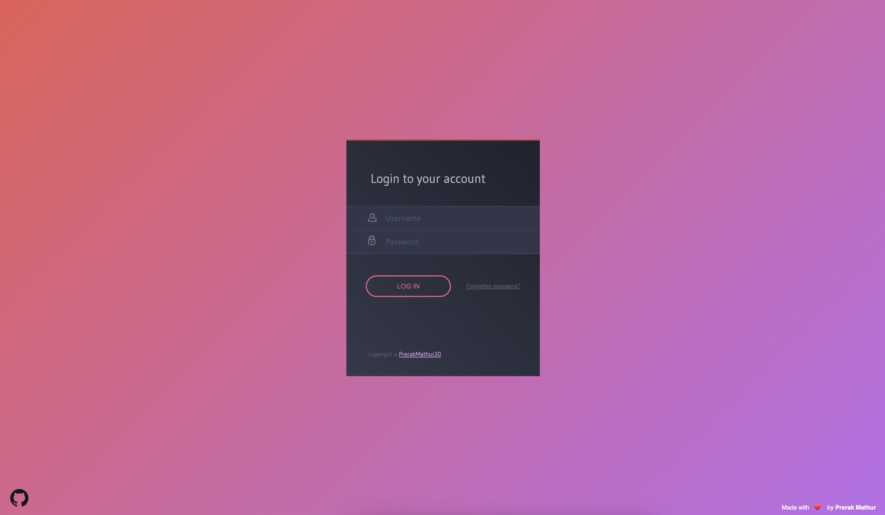   | 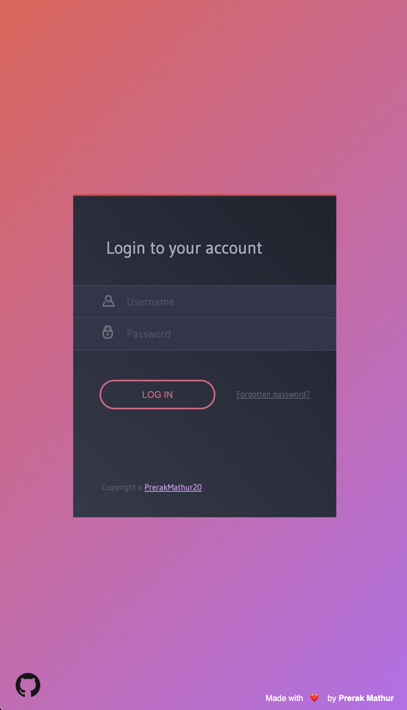 |[@PrerakMathur20](https://github.com/PrerakMathur20)| 
| login-form-24  | 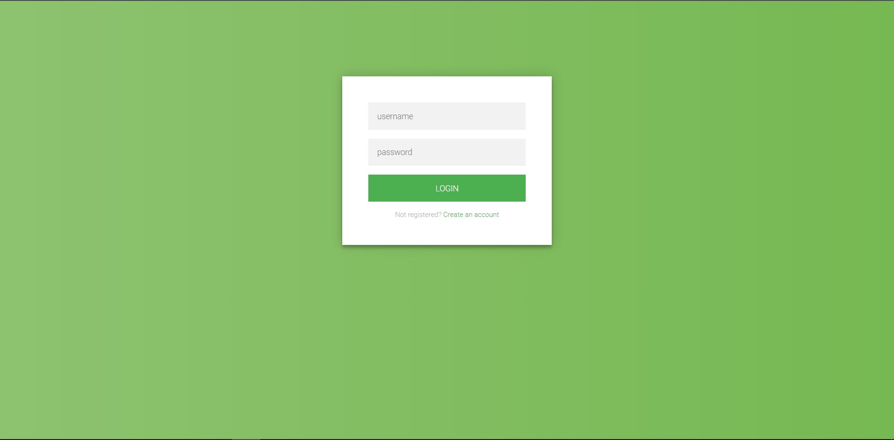   |    | [@idivyanshbansal](https://github.com/idivyanshbansal) |
| login-form-25  |   |  | [@PuneethKShetty](https://github.com/PuneethKShetty) 
| login-form-26  | 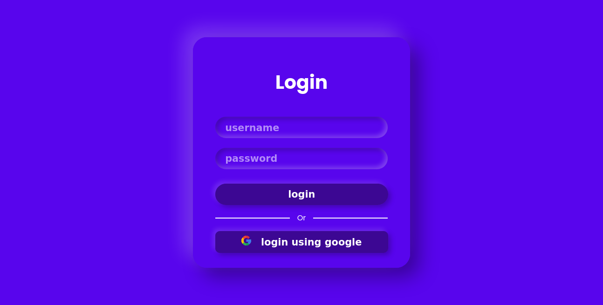  |  | [@codeswithroh](https://github.com/codeswithroh) 
| login-page-1 |  || [@Swatigupta-droid](https://github.com/Swatigupta-droid) |
| login-form-ver2 | 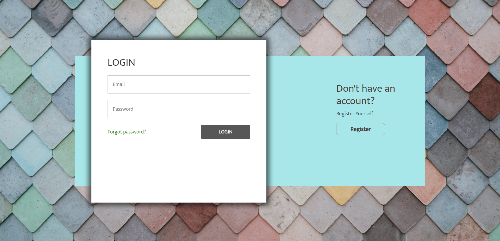 || [@RashmiShukla07](https://github.com/RashmiShukla07)|
| login-page-ver03 |    | | [@AwsmNinad25](https://github.com/AwsmNinad25) |
| login-form-pawar-adesh | 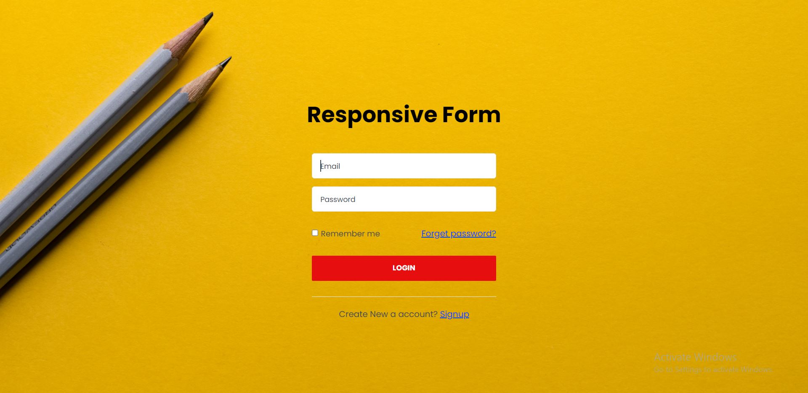    | 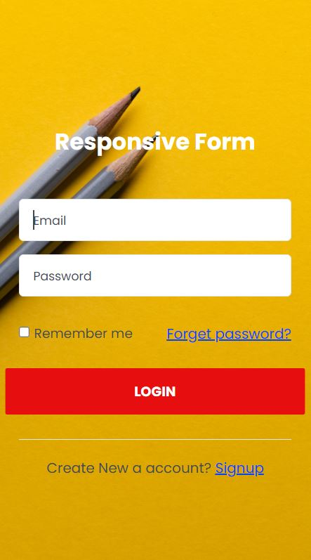   |  [@adesh.pawar](https://github.com/pawar-adesh) |
| Signin/Signup  |     |    |  [@HarnishSavsani](https://github.com/HarnishSavsani) 
| login-form-djm | 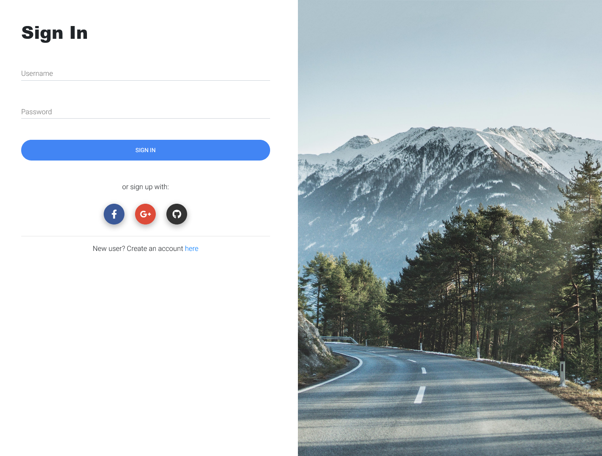    | 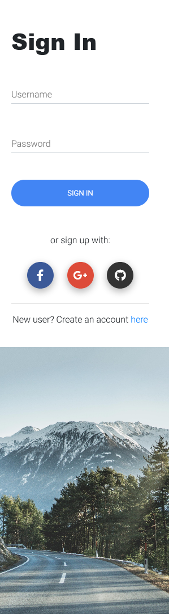   |  [@djm-1](https://github.com/djm-1) |
| login-form-v1  |    | | [@abhir9](https://github.com/abhir9)               |
| login-form-v2  |    || [@abhir9](https://github.com/abhir9)               |
| login-form-v3  |    || [@abhir9](https://github.com/abhir9)               |
| login-form-v4  |    || [@abhir9](https://github.com/abhir9)               |
| login-form-v5  |    || [@abhir9](https://github.com/abhir9)               |
| login-form-v6  |    || [@abhir9](https://github.com/abhir9)               |
| login-form-v7  |    || [@abhir9](https://github.com/abhir9)               |
| login-form-v8  |    || [@abhir9](https://github.com/abhir9)               |
| login-form-v9  |    || [@abhir9](https://github.com/abhir9)               |
| login-form-v10 |  || [@abhir9](https://github.com/abhir9)               |
| login-form-v11 |  ||[@abhir9](https://github.com/abhir9)                |
| login-form-v12 |  || [@abhir9](https://github.com/abhir9)               |
| login-form-v13 |  || [@abhir9](https://github.com/abhir9)               |
| login-form-v14 |  || [@herkura](https://github.com/herkura)  [@nshanbhag20001412](https://github.com/nshanbhag20001412)             |
| login-form-v15 |  |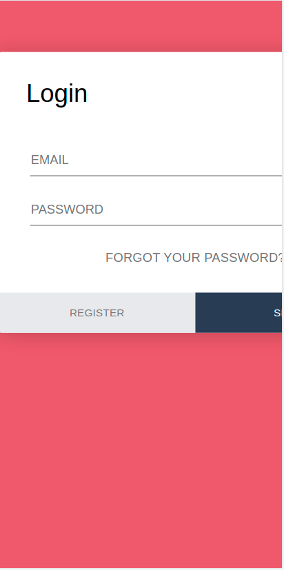| [@shrish-sharma-git](https://github.com/shrish-sharma-git) |
| login-form-v16 |  |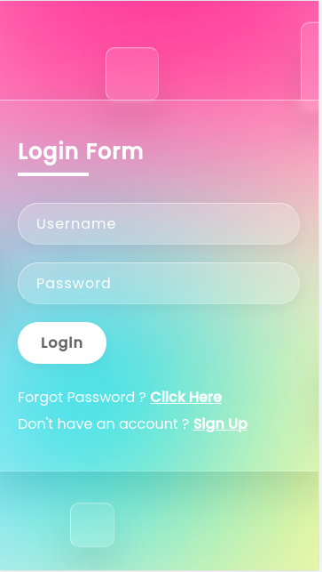| [@imtiyazMohammed](https://github.com/imtiyazMohammed) |
| login-form-v17 |   |  |   [@satyam73](https://github.com/satyam73)               |
| login-form-v18 | 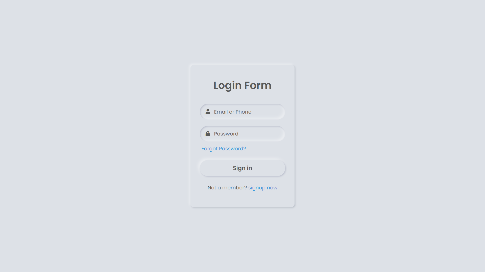  | 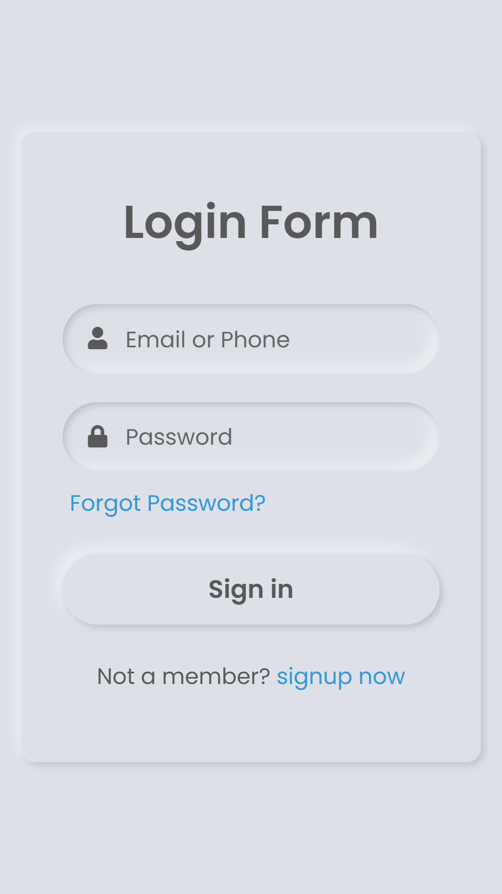 |   [@AmreshSinha](https://github.com/AmreshSinha)               |
| login-form-v19 |    |  || [@DoraTheExplorax](https://github.com/DoraTheExplorax) 
| login-form-v20 | 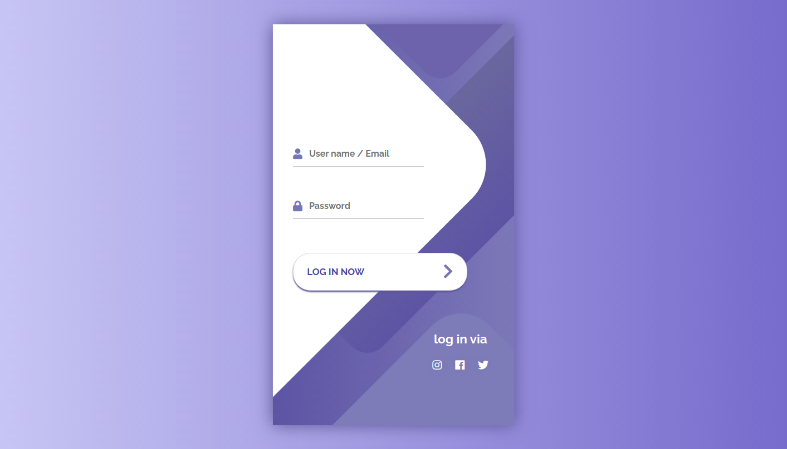 | | [@soumyajit4419](https://github.com/soumyajit4419) |
| login-form-v21 |     |    |  [@subham5230](https://github.com/subham5230) |
| login-form-v22  |    |  |   [@noviicee](https://github.com/noviicee)               |
| login-form-v23  |    |  |   [@shutterberg](https://github.com/shutterberg)               |
| login-form-v24  |    |  |   [@ssm0801](https://github.com/ssm0801)               |

## CONTRIBUTION

- For contribution please check [contribution guideline](https://github.com/LoginRadius/awesome-login-pages/blob/main/CONTRIBUTING.md)
- Please check the [issue list](https://github.com/LoginRadius/awesome-login-pages/issues) .

## CONTRIBUTORS
Amazing person who made their contributions. Feel free to contribute!

## LICENSE : [MIT](https://github.com/LoginRadius/awesome-login-pages/blob/main/LICENSE)
