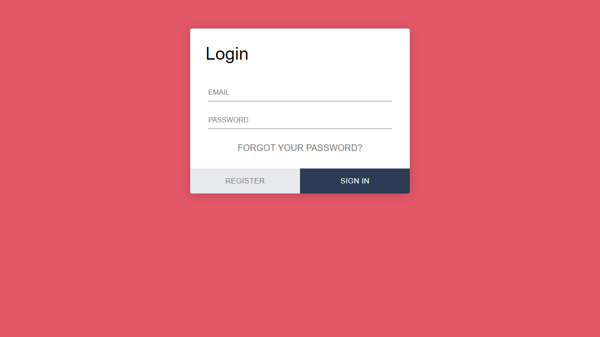
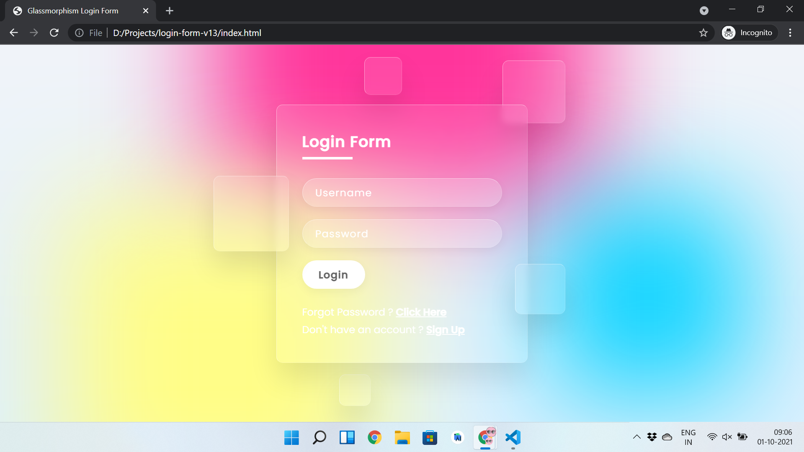
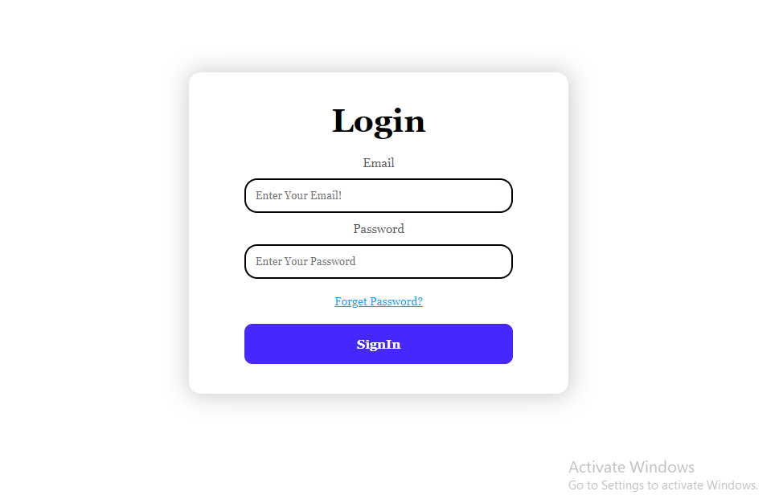
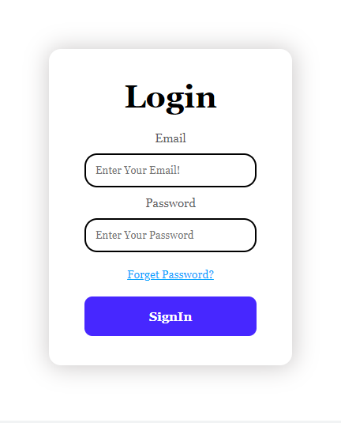

# Awesome Login pages

A Project which includes curated list of different login page web pages.

| Name           |  Desktop Screenshot                                                                                                                           |Mobile Screenshot                                                             | Contributed by                                     |
| -------------- | --------------------------------------------------------------------------------------------------------------------------------------------- |------------------------------------------------------------------------------|-------------------------------------------------- |
| login-form-01  |     |    |  [@hiteshkumawat](https://github.com/hiteshkumawat) [@nshanbhag20001412](https://github.com/nshanbhag20001412) |
| login-form-02  |    |    | [@hiteshkumawat](https://github.com/hiteshkumawat) [@nshanbhag20001412](https://github.com/nshanbhag20001412)|
| login-form-03  |    |    | [@abhir9](https://github.com/abhir9)               [@nshanbhag20001412](https://github.com/nshanbhag20001412)|
| login-form-04  |    |    | [@hiteshkumawat](https://github.com/hiteshkumawat) [@nshanbhag20001412](https://github.com/nshanbhag20001412)|
| login-form-05  |    |    | [@abhir9](https://github.com/abhir9)               [@nshanbhag20001412](https://github.com/nshanbhag20001412)|
| login-form-06  |    |    | [@abhir9](https://github.com/abhir9)               [@nshanbhag20001412](https://github.com/nshanbhag20001412)|
| login-form-07  |    |    | [@hiteshkumawat](https://github.com/hiteshkumawat) [@nshanbhag20001412](https://github.com/nshanbhag20001412)|
| login-form-08  |    |    | [@abhir9](https://github.com/abhir9)               |
| login-form-09  |    |    | [@abhir9](https://github.com/abhir9)               |
| login-form-10  |    |    | [@hiteshkumawat](https://github.com/hiteshkumawat) |
| login-form-11  |    |    | [@abhir9](https://github.com/abhir9)               |
| login-form-12  |    |    | [@abhir9](https://github.com/abhir9)               |
| login-form-13  |    |    | [@hiteshkumawat](https://github.com/hiteshkumawat) |
| login-form-14  |    | | [@tirtharajsinha](https://github.com/tirtharajsinha)  |
| login-form-ver2 |  || [@RashmiShukla07](https://github.com/RashmiShukla07)|
| login-page-1 |  || [@Swatigupta-droid](https://github.com/Swatigupta-droid) |
| login-form-v1  |    | | [@abhir9](https://github.com/abhir9)               |
| login-form-v2  |    || [@abhir9](https://github.com/abhir9)               |
| login-form-v3  |    || [@abhir9](https://github.com/abhir9)               |
| login-form-v4  |    || [@abhir9](https://github.com/abhir9)               |
| login-form-v5  |    || [@abhir9](https://github.com/abhir9)               |
| login-form-v6  |    || [@abhir9](https://github.com/abhir9)               |
| login-form-v7  |    || [@abhir9](https://github.com/abhir9)               |
| login-form-v8  |    || [@abhir9](https://github.com/abhir9)               |
| login-form-v9  |    || [@abhir9](https://github.com/abhir9)               |
| login-form-v10 |  || [@abhir9](https://github.com/abhir9)               |
| login-form-v11 |  ||[@abhir9](https://github.com/abhir9)                |
| login-form-v12 |  || [@abhir9](https://github.com/abhir9)               |
| login-form-v13 |  || [@abhir9](https://github.com/abhir9)               |
| login-form-v14 |  || [@herkura](https://github.com/herkura)  [@nshanbhag20001412](https://github.com/nshanbhag20001412)             |
| login-form-v15 |  || [@shrish-sharma-git](https://github.com/shrish-sharma-git) |
| login-form-v16 |  || [@imtiyazMohammed](https://github.com/imtiyazMohammed) |
| login-form-v17  |    |  |   [@satyam73](https://github.com/satyam73)               |
| login-form-v21  |     |    |  [@subham5230](https://github.com/subham5230) |

## CONTRIBUTION

- For contribution please check [contribution guideline](https://github.com/LoginRadius/awesome-login-pages/blob/main/CONTRIBUTING.md)
- Please check the [issue list](https://github.com/LoginRadius/awesome-login-pages/issues) .

## LICENSE : [MIT](https://github.com/LoginRadius/awesome-login-pages/blob/main/LICENSE)
